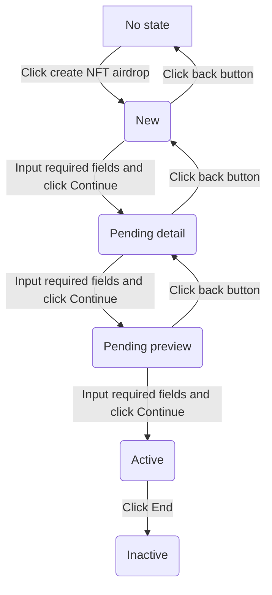

### [LinkDetail](#linkdetail)

| Property    | Type                                  | Description                                 | Example Value          |
| ----------- | ------------------------------------- | ------------------------------------------- | ---------------------- |
| id          | String                                | Identifier for the link template            | 12345                  |
| title       | String                                | Title of the link                           | Motoko Airdrop         |
| description | String                                | Brief summary of the action to be performed | This is motoko airdrop |
| image       | String                                | Image for the link                          |                        |
| linkType    | [LinkType](#LinkType)                 | Type of the link                            | NFT_CREATE_AND_AIRDROP |
| assetInfo   | [AssetAirdropInfo](#AssetAirdropInfo) | Information about the asset airdrop         |                        |
| actions     | [Action](#action)[]                   | Array of actions                            |                        |
| template    | [Template](#template)                 | Layout for rendering the link               |                        |
| state       | [State](#state)                       | Current state of the link                   | Active                 |
| creator-pid | ...                                   | ...                                         | ...                    |

```rust
struct LinkDetail{
    id: String,
    title: String,
    description: String,
    image: String,
    linkType: LinkType,
    assetInfo: AssetAirdropInfo,
    actions: Action[],
    template: Temaplte,
    state: State
}
```

### LinkType

```rust
enum LinkType {
    NFT_CREATE_AND_AIRDROP
}
```

### AssetAirdropInfo

```rust
enum Chain {
    ICP
}

struct AssetAirdropInfo{
    address: String,
    chain: Chain,
    amount: u32,
}
```

### Action

```rust
struct Action{
    canisterId: String,
    label: String,
    method: String,
    arg: String // base64
}
```

`canisterId` canister id

`label` for render button label

`method` canister method to call

`arg` base64 string of arg input to method

### Template

```rust
enum Template {
    Left,
    Right,
    Central
}
```

### State

```rust
enum State {
    New,
    PendingDetail,
    PendingPreview,
    Active,
    Inactive,
}
```

// TODO: add backend to this diagram



### Backend

#### 1. Create link with `New` state

```rust
struct NewStateArgs {
    title: String,
    template: Temaplte,
    linkType: LinkType
}

fn create_link(args: NewStateArgs)
```

JSON example

```json
{
  "title": "builder meetup",
  "template": "Central",
  "linkType": "NFT_CREATE_AND_AIRDROP"
}
```

#### 2. Update the link State

```rust
struct PendingDetailStateArgs{
    description: String,
    image: String,
    assetInfo: AssetInfo,
    actions: Action[]
}

struct NewStateArgs{
    title: String,
    template: Temaplte,
}

enum UpdateLinkStateArgs {
    New(NewStateArgs)
    PendingDetail(PendingDetailStateArgs),
    Active,
    Inactive
}

fn update_link_state(args: UpdateLinkStateArgs)
```

`UpdateLinkStateArgs` JSON example

```json
{
  "description": "airdrop test",
  "image": "http://test.com",
  "assetInfo": {
    "address": "rh2pm-ryaaa-aaaan-qeniq-cai",
    "chain": "ICP",
    "amount": 10000
  },
  "actions": [
    {
      "address": "rh2pm-ryaaa-aaaan-qeniq-cai",
      "label": "Claim",
      "method": "claim",
      "arg": ""
    }
  ]
}
```

#### 3. Get link detail

```rust
fn get_link_detail(id: String) -> LinkDetail
```

#### 4. Get links of a user

```rust
fn get_links() -> LinkDetail[]
```

#### 5. User

// TODO: talk about this

// TODO: Test about user login with google, what props for user
